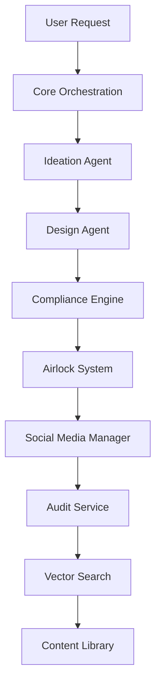

# Architecture Overview

Comprehensive overview of the Enhanced AI Agent OS v2 system architecture, components, and design patterns.

## System Architecture

The Enhanced AI Agent OS v2 follows a microservices architecture with clear separation of concerns across multiple layers:

```
┌─────────────────────────────────────────────────────────────┐
│                    User Interface Layer                     │
├─────────────────────────────────────────────────────────────┤
│  Mission Control Dashboard (React) - Port 3000             │
│  API Gateway & Documentation - Port 8000                   │
└─────────────────────────────────────────────────────────────┘
                              │
┌─────────────────────────────────────────────────────────────┐
│                   Core Orchestration                       │
├─────────────────────────────────────────────────────────────┤
│  Task Management │ Workflow Engine │ Service Discovery     │
│  Event Bus       │ Load Balancer   │ Health Monitoring     │
└─────────────────────────────────────────────────────────────┘
                              │
┌─────────────────────────────────────────────────────────────┐
│                    Creator Layer                           │
├─────────────────────────────────────────────────────────────┤
│  Ideation Agent  │ Design Agent   │ Video Agent           │
│  (Port 8001)     │ (Port 8002)    │ (Port 8003)           │
│                  │                │                        │
│  Social Media Manager             │ Content Optimizer      │
│  (Port 8004)                      │                        │
└─────────────────────────────────────────────────────────────┘
                              │
┌─────────────────────────────────────────────────────────────┐
│                  Enterprise Layer                          │
├─────────────────────────────────────────────────────────────┤
│  Compliance Engine │ Audit Service │ Governance Dashboard │
│  (Port 8005)       │ (Port 8006)   │ (Port 8007)          │
│                    │               │                       │
│  Airlock System    │ Policy Engine │ Risk Assessment      │
└─────────────────────────────────────────────────────────────┘
                              │
┌─────────────────────────────────────────────────────────────┐
│                 Data Architecture                          │
├─────────────────────────────────────────────────────────────┤
│  Vector Search    │ Memory System  │ Knowledge Base       │
│  (Port 8008)      │ (Port 8009)    │                      │
│                   │                │                       │
│  PostgreSQL       │ Redis Cache    │ Pinecone Vector DB   │
└─────────────────────────────────────────────────────────────┘
                              │
┌─────────────────────────────────────────────────────────────┐
│              Monitoring & Infrastructure                   │
├─────────────────────────────────────────────────────────────┤
│  Prometheus (9090) │ Grafana (3001) │ Docker Compose     │
│  Log Aggregation   │ Alerting       │ Service Mesh       │
└─────────────────────────────────────────────────────────────┘
```

## Core Components

### 1. Core Orchestration Layer

**Purpose**: Central coordination and task management
**Port**: 8000
**Technology**: FastAPI, Python

**Key Responsibilities**:
- Task queue management and distribution
- Service discovery and health monitoring
- Workflow orchestration
- Event-driven communication
- Load balancing and routing

**Key Components**:
```python
# Core orchestration components
TaskManager()          # Manages task lifecycle
WorkflowEngine()       # Orchestrates multi-step processes
ServiceRegistry()      # Tracks available services
EventBus()            # Inter-service communication
HealthMonitor()       # Service health tracking
```

### 2. Creator Layer Services

#### Ideation Agent (Port 8001)
**Purpose**: AI-powered content ideation with market intelligence
**Technology**: FastAPI, OpenRouter LLM integration

**Core Components**:
- `MarketIntelligenceEngine`: Analyzes trends and competitor content
- `IdeationEngine`: Generates contextually relevant content ideas
- `TrendAnalyzer`: Identifies emerging topics and opportunities
- `AudienceProfiler`: Tailors content to specific demographics

#### Design Agent (Port 8002)
**Purpose**: Automated design creation with brand consistency
**Technology**: FastAPI, Canva API integration

**Core Components**:
- `CanvaAPIClient`: Interface to Canva design platform
- `BrandConsistencyEngine`: Enforces brand guidelines
- `TemplateManager`: Manages design templates and assets
- `ComplianceScorer`: Evaluates brand adherence

#### Video Agent (Port 8003)
**Purpose**: AI-powered video content creation
**Technology**: FastAPI, Descript API integration

**Core Components**:
- `DescriptAPIClient`: Video creation and editing
- `ScriptGenerator`: AI-powered script writing
- `VoiceEngine`: Text-to-speech conversion
- `VideoAssembler`: Automated video production

#### Social Media Manager (Port 8004)
**Purpose**: Multi-platform campaign execution
**Technology**: FastAPI, Social platform APIs

**Core Components**:
- `PlatformAdapter`: Unified interface for social platforms
- `CampaignExecutor`: Automated posting and scheduling
- `EngagementTracker`: Performance monitoring
- `A/BTestManager`: Content variant testing

### 3. Enterprise Layer Services

#### Compliance Engine (Port 8005)
**Purpose**: Automated policy enforcement and content validation
**Technology**: FastAPI, Rule engine

**Core Components**:
- `PolicyEngine`: Defines and enforces organizational policies
- `ContentScanner`: Automated content analysis
- `RiskAssessment`: Evaluates content risk levels
- `ViolationDetector`: Identifies policy violations

#### Audit Service (Port 8006)
**Purpose**: Comprehensive activity logging and compliance tracking
**Technology**: FastAPI, PostgreSQL

**Core Components**:
- `ActivityLogger`: Records all system activities
- `ComplianceReporter`: Generates audit reports
- `UserTracker`: Monitors user actions
- `DataRetention`: Manages log lifecycle

#### Governance Dashboard (Port 8007)
**Purpose**: Enterprise governance interface and controls
**Technology**: FastAPI, React components

**Core Components**:
- `PolicyManager`: Policy creation and management
- `ApprovalWorkflow`: Multi-stage review processes
- `ComplianceDashboard`: Real-time compliance monitoring
- `RoleManager`: User permissions and access control

### 4. Data Architecture Services

#### Vector Search Service (Port 8008)
**Purpose**: Semantic search and content discovery
**Technology**: FastAPI, Pinecone, sentence-transformers

**Core Components**:
- `EmbeddingGenerator`: Creates vector representations
- `SemanticSearch`: Similarity-based content retrieval
- `RecommendationEngine`: Content suggestions
- `IndexManager`: Vector database management

#### Memory System Service (Port 8009)
**Purpose**: Intelligent context and memory management
**Technology**: FastAPI, Redis, PostgreSQL

**Core Components**:
- `ContextManager`: Maintains conversation context
- `LearningEngine`: Improves responses based on feedback
- `PersonalizationEngine`: Adapts to user preferences
- `KnowledgeGraph`: Connects related information

## Design Patterns

### 1. Microservices Architecture

**Benefits**:
- Independent scaling and deployment
- Technology diversity
- Fault isolation
- Team autonomy

**Implementation**:
- Each service runs in its own container
- RESTful APIs for inter-service communication
- Service discovery via Docker networking
- Health checks and monitoring

### 2. Event-Driven Architecture

**Event Bus Implementation**:
```python
class EventBus:
    def __init__(self):
        self.subscribers = defaultdict(list)
    
    def publish(self, event_type: str, data: dict):
        for callback in self.subscribers[event_type]:
            callback(data)
    
    def subscribe(self, event_type: str, callback):
        self.subscribers[event_type].append(callback)
```

**Common Events**:
- `task.created`
- `content.generated`
- `compliance.violation`
- `campaign.executed`

### 3. Plugin Architecture

**Service Registration**:
```python
class ServiceRegistry:
    def __init__(self):
        self.services = {}
    
    def register(self, service_name: str, service_instance):
        self.services[service_name] = service_instance
    
    def get_service(self, service_name: str):
        return self.services.get(service_name)
```

### 4. Factory Pattern

**Agent Factory**:
```python
class AgentFactory:
    @staticmethod
    def create_agent(agent_type: str, config: dict):
        if agent_type == "ideation":
            return IdeationAgent(config)
        elif agent_type == "design":
            return DesignAgent(config)
        # ... other agent types
```

## Data Flow

### Content Creation Pipeline



### Detailed Flow:

1. **Request Initiation**: User submits content creation request
2. **Task Orchestration**: Core service creates and queues tasks
3. **Idea Generation**: Ideation agent generates content concepts
4. **Design Creation**: Design agent creates visual assets
5. **Compliance Check**: Automated policy validation
6. **Human Review**: Airlock system for manual approval
7. **Campaign Execution**: Multi-platform publishing
8. **Activity Logging**: Comprehensive audit trail
9. **Knowledge Storage**: Vector embeddings for future reference
10. **Content Archival**: Organized storage and retrieval

## Security Architecture

### Authentication & Authorization

```python
# JWT-based authentication
class AuthManager:
    def generate_token(self, user_id: str, permissions: list) -> str:
        payload = {
            "user_id": user_id,
            "permissions": permissions,
            "exp": datetime.utcnow() + timedelta(hours=24)
        }
        return jwt.encode(payload, SECRET_KEY, algorithm="HS256")
```

### API Security

- **Rate Limiting**: Prevent abuse and ensure fair usage
- **Input Validation**: Sanitize and validate all inputs
- **CORS Configuration**: Control cross-origin requests
- **SSL/TLS**: Encrypted communication in production

### Data Security

- **Encryption at Rest**: Database and file encryption
- **Encryption in Transit**: HTTPS/TLS for all communications
- **Access Control**: Role-based permissions
- **Audit Logging**: Comprehensive activity tracking

## Scalability Considerations

### Horizontal Scaling

**Service Scaling**:
```yaml
# docker-compose.scale.yml
services:
  ideation_agent:
    deploy:
      replicas: 3
  design_agent:
    deploy:
      replicas: 2
```

**Load Balancing**:
- Nginx reverse proxy
- Round-robin distribution
- Health check integration
- Session affinity where needed

### Database Scaling

**Read Replicas**:
```python
# Database routing
class DatabaseRouter:
    def db_for_read(self, model, **hints):
        return 'replica'
    
    def db_for_write(self, model, **hints):
        return 'primary'
```

**Caching Strategy**:
- Redis for session and application cache
- CDN for static assets
- Database query caching
- API response caching

## Monitoring Architecture

### Metrics Collection

**Prometheus Metrics**:
```python
from prometheus_client import Counter, Histogram, Gauge

# Custom metrics
request_count = Counter('http_requests_total', 'Total HTTP requests')
request_duration = Histogram('http_request_duration_seconds', 'HTTP request duration')
active_tasks = Gauge('active_tasks_total', 'Number of active tasks')
```

### Health Monitoring

**Health Check Endpoint**:
```python
@app.get("/health")
async def health_check():
    return {
        "status": "healthy",
        "timestamp": datetime.utcnow(),
        "services": {
            "database": check_database_connection(),
            "vector_store": check_vector_store_connection(),
            "external_apis": check_external_apis()
        }
    }
```

### Alerting Rules

**Critical Alerts**:
- Service downtime
- High error rates
- Database connection failures
- API quota exhaustion

**Warning Alerts**:
- High response times
- Memory usage spikes
- Disk space low
- SSL certificate expiration

## Deployment Architecture

### Container Orchestration

**Docker Compose Structure**:
```yaml
version: '3.8'
services:
  # Core services
  core_orchestration:
    build: ./services/core_services/orchestration
    ports: ["8000:8000"]
    depends_on: [postgres, redis]
  
  # Creator layer
  ideation_agent:
    build: ./services/creator_layer/ideation
    ports: ["8001:8001"]
  
  # Data layer
  postgres:
    image: postgres:13
    volumes: [postgres_data:/var/lib/postgresql/data]
  
  redis:
    image: redis:6-alpine
```

### Environment Management

**Configuration Hierarchy**:
1. Default configuration
2. Environment-specific overrides
3. Secret management
4. Runtime configuration

### CI/CD Pipeline

**Deployment Stages**:
1. Code commit and push
2. Automated testing
3. Security scanning
4. Container building
5. Staging deployment
6. Production deployment
7. Health verification

## Performance Optimization

### Caching Strategy

**Multi-Level Caching**:
- Application-level caching
- Database query caching
- CDN for static assets
- Browser caching

### Database Optimization

**Query Optimization**:
- Proper indexing strategy
- Query plan analysis
- Connection pooling
- Read/write splitting

### API Optimization

**Response Optimization**:
- Pagination for large datasets
- Field selection
- Response compression
- Async processing for long operations

## Future Architecture Considerations

### Planned Enhancements

1. **Kubernetes Migration**: Container orchestration at scale
2. **Message Queue**: Async processing with RabbitMQ/Kafka
3. **API Gateway**: Centralized routing and security
4. **Service Mesh**: Advanced networking and security
5. **Machine Learning Pipeline**: MLOps integration
6. **Multi-Region Deployment**: Global availability

### Technology Roadmap

- **Short Term**: Performance optimization, monitoring enhancement
- **Medium Term**: Kubernetes adoption, ML pipeline integration
- **Long Term**: Multi-cloud deployment, advanced AI capabilities
